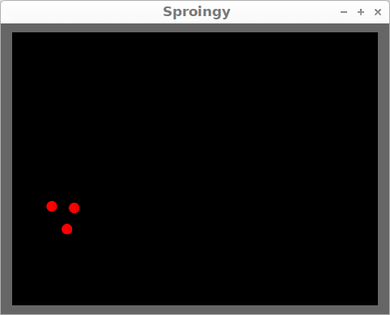

# Sproingy

A toy project for learning about some things:
 * [Zig](https://ziglang.org/)
 * GUI toolkits with OpenGL support ([GLFW](https://www.glfw.org/), [SDL2](http://wiki.libsdl.org/), [GTK3](https://developer.gnome.org/gtk3/stable/))
 * [Verlet integration](https://en.wikipedia.org/wiki/Verlet_integration) for simple physics modeling

    


## Build & Run

Development is all on Linux x86-64 so far, but in theory everything should work on any platform where Zig, GTK3, and OpenGL are supported.

To build and run the first time:
```
header-tweaks.sh && zig build run
```
The header-tweaks script only needs to be run the first time you build. It makes local copies of some GTK headers, and patches them so that Zig can digest them easily.


## License

[BSD 3-Clause](LICENSE)
